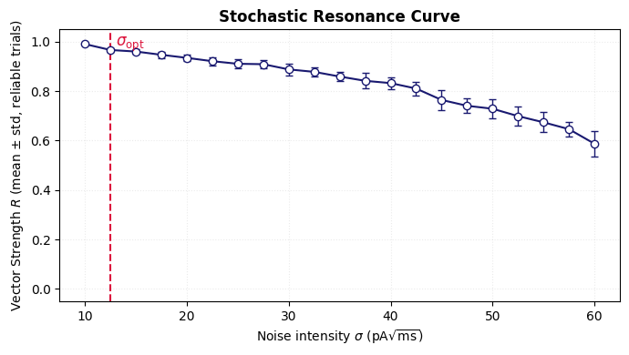
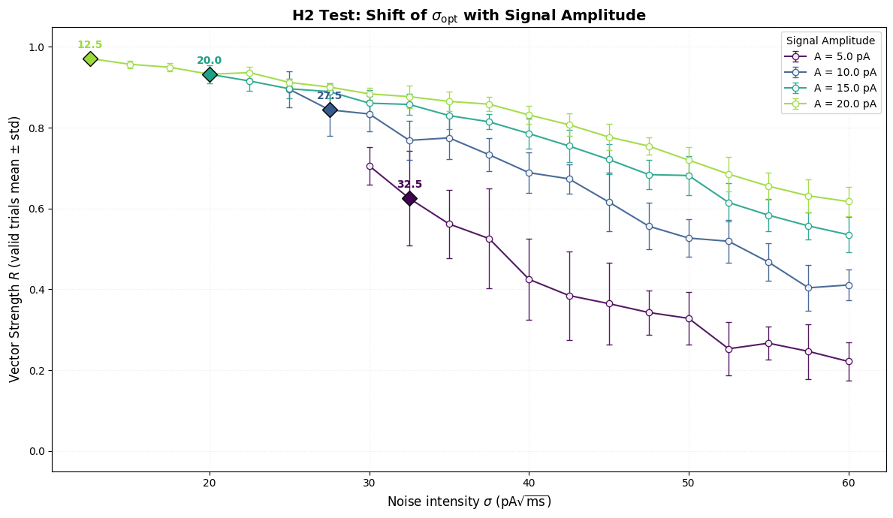
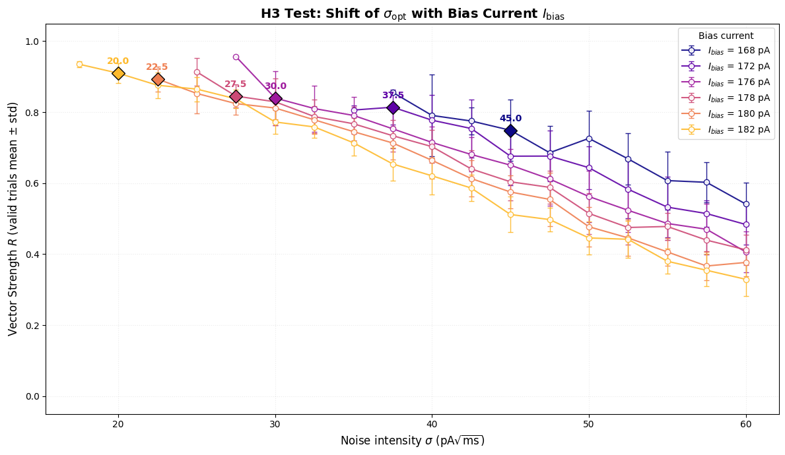
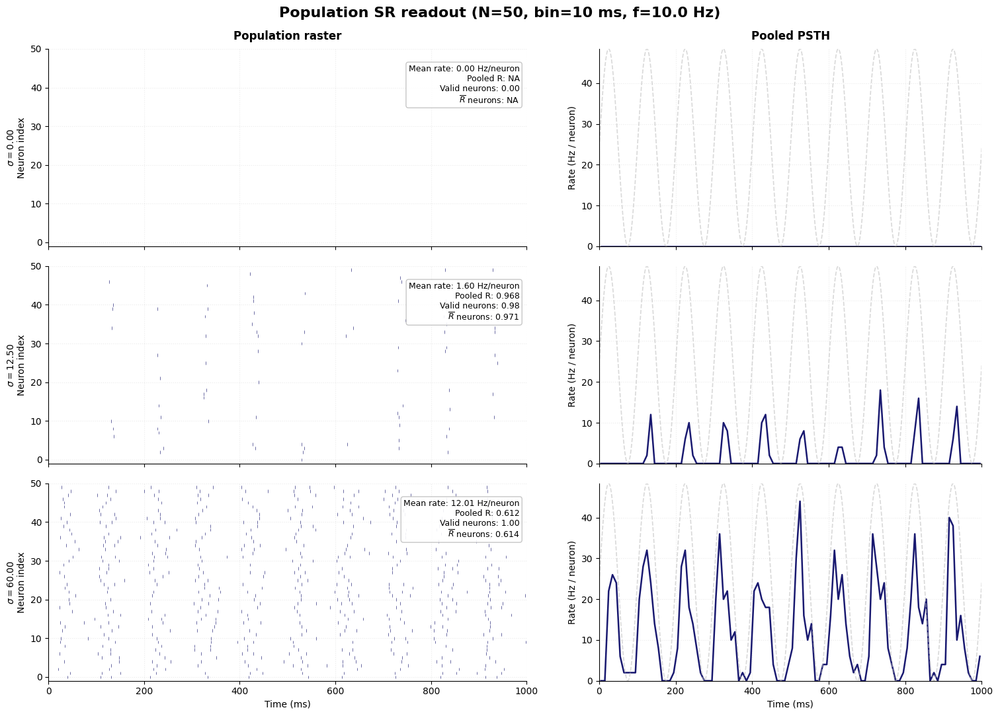

# Brain Modeling Project – Stochastic Resonance in LIF Neurons
Computational study of **noise-assisted signal detection in neurons** using the Leaky Integrate-and-Fire (LIF) model.  
The project investigates how stochastic fluctuations influence spike timing and improve temporal synchronization with weak periodic signals.

## Project Overview
Neural systems operate in intrinsically noisy environments where stochastic fluctuations continuously affect membrane dynamics and spike generation. Although noise is often considered detrimental to information transmission, in nonlinear threshold systems it can play a functional role.

In particular, **Stochastic Resonance (SR)** describes a phenomenon in which an optimal level of noise enhances the detection of weak signals.

Neurons are natural threshold systems: action potentials are generated only when the membrane potential crosses a firing threshold. When a weak periodic input is present, noise can assist threshold crossings, allowing spikes to synchronize with the underlying signal.

In this project, we investigate Stochastic Resonance using the **Leaky Integrate-and-Fire (LIF) neuron model**, first at the single-neuron level and then at the population level.

The analysis explores how noise affects spike–signal synchronization and how population averaging stabilizes temporal signal representation.

## Research Hypotheses
The project tests five main hypotheses regarding stochastic resonance in neural systems:

- **H1 – Optimal Noise Level**: Spike–signal synchronization is maximal at an intermediate noise intensity.
- **H2 – Dependence on Signal Amplitude**: Increasing the signal amplitude shifts the optimal noise level toward lower values.
- **H3 – Dependence on Operating Point**: Increasing the DC bias current moves the neuron closer to threshold and reduces the noise level required for optimal synchronization.
- **H4 – High-Noise Degradation**: Excessive noise degrades spike–signal synchronization despite increasing firing activity.
- **H5 – Population-Level Robustness**: Pooling the activity of multiple independent neurons produces more stable and robust temporal representations of the input signal. :contentReference[oaicite:1]{index=1}

## Model
Neural dynamics are modeled using a **Leaky Integrate-and-Fire neuron**, which describes a neuron as a threshold system integrating incoming current.

The membrane potential evolves according to: τm dV/dt = −(V − EL) + I(t)/gL
where
- τm : membrane time constant  
- EL : leak reversal potential  
- gL : leak conductance  

When the membrane potential reaches the threshold \(V_{th}\), a spike is generated and the voltage is reset.

The neuron receives a **subthreshold sinusoidal input**: I(t) = Ibias + A sin(2πft)
where
- Ibias : bias current  
- A : signal amplitude  
- f : signal frequency  

Gaussian white noise is added to the input current to study stochastic resonance.

## Analytical Workflow
The computational experiment is organized into several steps.
1. **Baseline neuron configuration**: Implementation and validation of a reference LIF neuron.
2. **Subthreshold signal definition**: Construction of a sinusoidal input that remains below firing threshold.
3. **Noise injection**: Controlled Gaussian noise is added to the input current.
4. **Stochastic resonance sweep**: Noise intensity is systematically varied to identify the optimal synchronization regime.
5. **Phase synchronization analysis**: Spike–signal synchronization is quantified using the **Vector Strength** metric.
6. **Parametric analysis**: The effect of signal amplitude and bias current on the optimal noise level is evaluated.
7. **Population-level analysis**: The model is extended to a population of independent neurons to analyze collective signal encoding.

## Results and Insights
### Stochastic Resonance Curve
The stochastic resonance curve shows how spike–signal synchronization varies with noise intensity. Synchronization increases with noise up to an optimal level and then decreases as noise dominates spike timing.

This confirms the existence of an **optimal noise level that maximizes temporal synchronization**.

### Dependence on Signal Amplitude
Increasing the amplitude of the sinusoidal input shifts the optimal noise level toward lower values.

This indicates that stronger inputs require less noise to induce phase-locked threshold crossings.

### Dependence on Bias Current
Changing the DC bias current modifies the distance from threshold and therefore shifts the stochastic resonance regime.

Higher bias currents reduce the noise intensity required for optimal synchronization.

### Population-Level Effects
Extending the model to a population of neurons reveals that pooling spikes across neurons produces a robust population-level signal representation. Raster plots and PSTHs show clear oscillatory structure even when individual spike trains are sparse.

Population averaging stabilizes the temporal representation of the signal and enhances robustness.

## Tech Stack
Language: Python

Libraries:
- NumPy
- Matplotlib
- Pandas

Methods:
- computational neuroscience modeling
- Leaky Integrate-and-Fire neuron
- stochastic simulations
- phase-locking analysis
- population neural coding

## Project Materials
Additional materials for this project are available below.

- **Project Report**: Full methodological description and results.
[Read the report](BM_report.pdf)

- **Project Notebook**: Complete implementation of the simulations and analysis.
[Open the notebook](Brain_modelling.ipynb)

## Authors
Camera Beatrice, Gallo Sabina, Marrali Irene  

BSc in Artificial Intelligence @ Università degli Studi di Milano, Università degli Studi di Pavia, Università degli Studi di Milano-Bicocca
